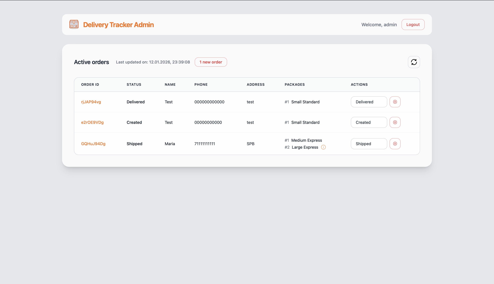
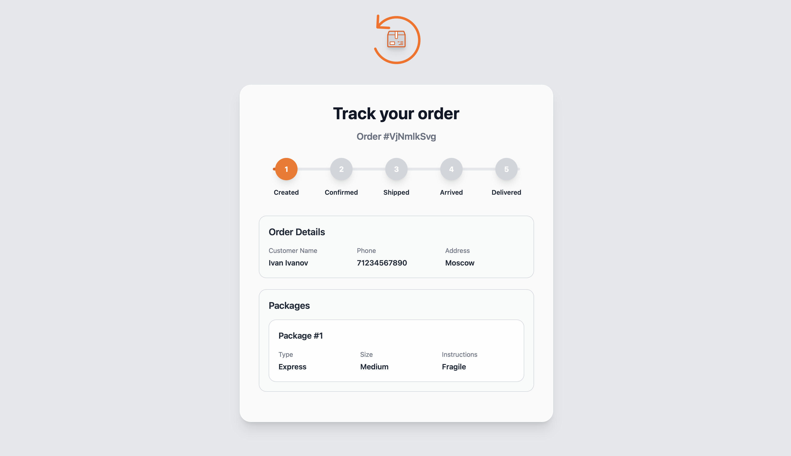

<p align="center">
  
</p>

<div align="center">
  <div>
    
    
  </div>
</div>

---

## Описание
**Delivery Tracker** — проект для отслеживания заказов доставки в реальном времени. Он реализует полный цикл работы с заказом: создание заказа клиентом, управление заказами администратором, мгновенные обновления статуса без перезагрузки страницы и система уведомлений

---

## Стек

<h4> FRONT-END (HTML templates, Tailwind CSS, EventSource (SSE))</h4>

[](https://skillicons.dev)

<h4> BACK-END (Go, Gin, Server-Sent Events (SSE), Sessions, Concurrency (sync.RWMutex))</h4>

[](https://skillicons.dev)

<h4> DB (SQLite, normalized schema, relations, CRUD)</h4>

[](https://skillicons.dev)

---

## Функциональные особенности

- Real-time обновление данных без WebSocket (Server-Sent Events)
- Собственный `NotificationManager` для работы с SSE
- Потокобезопасная система уведомлений
- Разделение ролей: клиент / администратор
- Серверный рендеринг шаблонов
- Чистая и расширяемая backend-архитектура

---

## Пользовательские роли

### Client
- Создание нового заказа через форму
- Просмотр статуса заказа
- Автоматическое обновление страницы при изменении статуса (SSE)
- Просмотр подробной информации о заказах

### Admin
- Авторизация в админ-панели
- Просмотр всех активных заказов
- Изменение статуса заказа пользователя
- Удаление заказов
- Система уведомлений о новых заказах в реальном времени
- Отображение времени последнего обновления

---

## Запуск проекта
После запуска приложение будет доступно по адресу `http://localhost:8080`
```bash
go run ./cmd
```

---

## Интерфейс

### Админ-панель
<p align="center">
  
</p>

### Страница отслеживания заказа
<p align="center">
  
</p>